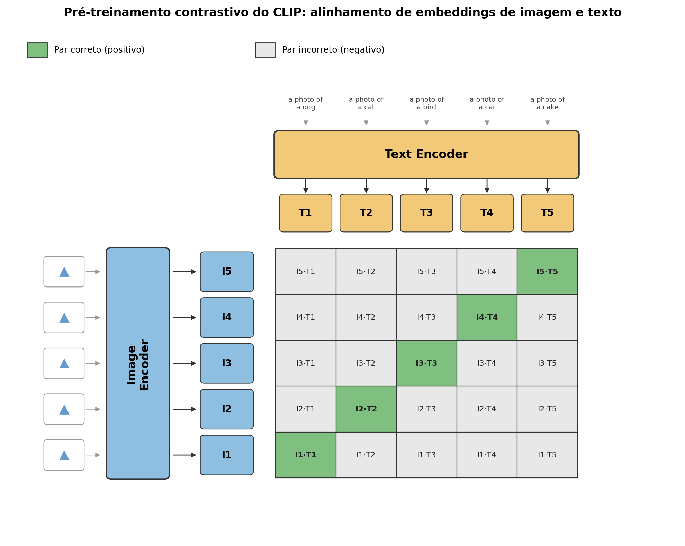

# eFAST-CLIP

#### Aluno: [Fagner Oliveira](https://github.com/fagnerrs)
#### Orientador: [Vitor Bento de Sousa](https://github.com/link_do_github).

---

Trabalho apresentado ao curso [VC MASTER](https://ica.puc-rio.ai/vc-master) como pré-requisito para conclusão de curso e obtenção de crédito na disciplina "Projetos de Sistemas Inteligentes de Apoio à Decisão".

- [Link para o código](https://github.com/fagnerrs/efast-clip).

- Trabalhos relacionados:
    - [FetalCLIP](https://arxiv.org/abs/2502.14807).
    - [Unimed-CLIP](https://arxiv.org/abs/2412.10372).

---

### Resumo

Inspirado por projetos como o FetalCLIP e o UnimedCLIP, este trabalho teve como objetivo desenvolver um modelo CLIP especializado em imagens do exame eFAST (*Extended Focused Assessment with Sonography for Trauma*). Para isso, buscou-se parceria junto à empresa DUOS AI, que forneceu um dataset composto por 22.673 imagens do exame, acompanhadas de anotações dos seus órgãos e de líquido livre. Dado o tamanho do dataset, escrever manualmente a descrição de cada imagem seria uma tarefa exaustiva e de alto custo, por exigir o apoio de um especialista. Para contornar esse problema, foi elaborado um template textual e um pipeline de geração automática de descrições a partir das anotações existentes. Com as descrições geradas, testou-se inicialmente a classificação *zero-shot* do modelo UnimedCLIP sobre 2.274 imagens do conjunto de teste, avaliando se o modelo acertava a janela correspondente a cada imagem. Em seguida, o modelo passou por *fine-tuning*, descongelando-se as últimas 5 e 10 camadas e utilizando 20.399 pares imagem-descrição gerados pelo pipeline. Na etapa final, os testes de classificação *zero-shot* foram refeitos com o modelo ajustado e as métricas comparadas. Concluiu-se que o UnimedCLIP, apesar de treinado com centenas de milhares de imagens médicas, apresenta baixo desempenho ao avaliar as janelas do exame eFAST. Após o *fine-tuning*, houve uma melhora considerável, passando de 19,83% (*zero-shot*) para 54,13% com apenas 20 épocas de treinamento, quase triplicando o resultado inicial e confirmando a eficiência do *fine-tuning*, mesmo com um dataset de tamanho moderado.

### 1. Introdução

O eFAST é um protocolo de ultrassonografia point-of-care utilizado para identificar líquido livre e outras lesões em pacientes de trauma, avaliando rapidamente diferentes janelas anatômicas (pulmonar, perisplênica, hepatorrenal, pélvica e subxifoide). Um modelo de visão computacional capaz de associar imagens desse exame a descrições textuais consistentes pode servir de base para aplicações de apoio à decisão, busca semântica de exames e geração automática de laudos.

### 2. Modelagem

O CLIP (*Contrastive Language-Image Pre-training*) é uma arquitetura de aprendizado contrastivo composta por dois codificadores treinados simultaneamente — um codificador de imagem (tipicamente um Vision Transformer, ViT) e um codificador de texto (um Transformer) —, que projetam imagens e textos em um mesmo espaço vetorial. Durante o treinamento, a função de perda contrastiva (InfoNCE) aproxima os vetores dos pares imagem-texto corretos de cada lote e afasta os pares incorretos, permitindo que o modelo aprenda a associar conceitos visuais às suas descrições textuais sem depender de um conjunto fixo de classes rotuladas, como ilustrado na figura abaixo.

Essa arquitetura tem pontos fortes bem estabelecidos: por treinar em escala e sem depender de rótulos de classe fixos, o CLIP generaliza bem para classificação *zero-shot*, busca semântica de imagens por texto (e vice-versa) e serve como uma base sólida e reutilizável para *fine-tuning* em domínios específicos, como o exame eFAST neste trabalho.

**2.1 Dataset**

O dataset foi cedido pela DUOS AI, empresa sediada em Canoas-RS focada em aplicações de IA para a área médica. As imagens foram coletadas no Hospital de Clínicas de Porto Alegre, com o consentimento dos pacientes, e exportadas do Roboflow no formato COCO. Além das imagens, o dataset traz anotações de bounding box dos órgãos e do líquido livre presente em cada imagem. Considerando apenas as imagens com pelo menos uma anotação, o dataset totaliza 22.673 pares imagem-anotação, divididos em treino (15.854), validação (4.545) e teste (2.274 imagens, mantido isolado para avaliação).

**2.2 Template de descrição das imagens**

Diante do volume de imagens, não seria viável um especialista revisar e descrever manualmente cada uma delas. Para resolver esse problema, foi elaborado um documento de RFC (`image-description-template.pdf`) propondo um template textual padronizado para cada janela do eFAST, relacionando janela, quadrante, órgãos visíveis e localização do líquido livre. O template proposto foi:

> *"[Quadrante] imagem eFAST da janela [Janela]. Órgãos visíveis são: [Órgãos]. Líquido livre [presente/ausente] no [Localização do líquido livre]."*

Esse documento foi compartilhado e validado com um médico ultrassonografista antes da geração das descrições em escala.

**2.3 Pipeline de geração das descrições**

Para permitir a geração automática das descrições a partir das anotações do dataset, foi criado o arquivo `categories-en.json`, contendo todas as 27 categorias de anotação do dataset (órgãos e líquido livre, por janela), acrescido de quatro campos preenchidos manualmente para cada categoria: `window` (janela a que a imagem pertence), `description` (nome do órgão), `quadrant` (localização do quadrante) e `freeFluidSpace` (espaço onde o líquido livre é procurado), além do indicador `isFreeFluid`.

Com base nesse dicionário, o pipeline do arquivo (`image-description-pipeline.py`) implementa duas tarefas: Geração de metadados e Geração da descrição: 

1. **Geração de metadados** — para cada partição do dataset (treino, validação e teste), as anotações COCO de cada imagem são combinadas com o `categories-en.json`, produzindo os arquivos `image-train-annotations.json`, `image-valid-annotations.json` e `image-test-annotations.json`, com a janela, o quadrante, os órgãos visíveis e a presença de líquido livre de cada imagem.
2. **Geração da descrição** — os metadados de cada imagem são usados para preencher o template validado com o especialista, produzindo o arquivo final `image-descriptions.json`, com um par imagem → descrição textual por imagem (por exemplo: *"eFAST image from quadrant Right Upper Quadrant (RUQ) and Hepatorenal (RUQ) window. Visible organs: Liver, Diaphragm, Kidney. Free fluid negative in the Morrison's pouch (hepatorenal space)"*).

Ao final dessa etapa, o dataset de treino e validação combinados geraram 20.399 pares imagem-descrição, usados na etapa de *fine-tuning*.

**2.4 Classificação zero-shot com o UnimedCLIP**

O projeto [UniMed-CLIP](https://github.com/fagnerrs/UniMed-CLIP) foi *forkado* para o repositório pessoal do autor e utilizado, sem qualquer ajuste de pesos, para uma avaliação *zero-shot* (`EFast_Zero_shot.ipynb`). O UnimedCLIP foi escolhido por já possuir uma base de treinamento ampla com imagens de ultrassom (base também usada no desenvolvimento do FetalCLIP), o que sugeria melhor capacidade de generalização para o domínio do eFAST do que modelos mais genéricos, como o BiomedCLIP. Para o teste, foram usadas as 2.274 imagens do conjunto de teste e cinco prompts textuais, um por janela do exame: *"Lung window"*, *"Perisplenic (LUQ) window"*, *"Pelvic window"*, *"Hepatorenal (RUQ) window"* e *"Subxiphoid window"*.

**2.5 Fine-tuning do UnimedCLIP**

Para o *fine-tuning* (`EFAST_Clip_Training.ipynb`), foram utilizados os 20.399 pares imagem-descrição gerados pelo pipeline. O treinamento é feito com a função de perda contrastiva InfoNCE (mesmo objetivo de treinamento do CLIP), otimizador Adam (lr = 5e-6, weight decay = 0.01), *scheduler* de *cosine annealing*, tamanho de lote 128 e precisão mista (AMP). O script permite congelar seletivamente o modelo, descongelando apenas as últimas *N* camadas do *transformer* do codificador de imagem e as últimas *N* camadas do codificador de texto (BiomedBERT), além das camadas de projeção — o que possibilitou testar diferentes combinações de camadas descongeladas e números de épocas, conforme descrito na seção de Resultados.

### 3. Resultados

Os resultados abaixo avaliam a tarefa de classificar a janela do exame eFAST a partir da imagem, comparando o modelo UnimedCLIP em modo *zero-shot* com duas configurações de *fine-tuning* (variando o número de épocas ecamadas congeladas), sempre sobre as 2.274 imagens do conjunto de teste.

**3.1 Zero-shot (pesos originais do UnimedCLIP)**

| Janela | Precisão | Recall | F1 | Suporte |
|---|---|---|---|---|
| Lung window | 0,00 | 0,00 | 0,00 | 359 |
| Perisplenic (LUQ) window | 0,39 | 0,64 | 0,49 | 525 |
| Pelvic window | 0,00 | 0,00 | 0,00 | 544 |
| Hepatorenal (RUQ) window | 0,00 | 0,00 | 0,00 | 731 |
| Subxiphoid window | 0,08 | 0,99 | 0,15 | 115 |

Acurácia geral: **19,83%**. O modelo, sem ajuste, concentra praticamente todas as previsões em apenas duas classes (Perisplenic e Subxiphoid), sem acertar nenhuma imagem de Lung, Pelvic ou Hepatorenal.

**3.2 Fine-tuning — 10 épocas**

Configuração: 20.399 pares imagem-descrição; últimas 5 camadas descongeladas no codificador de imagem; últimas 5 camadas + *pooler* + projeção descongeladas no codificador de texto (BiomedBERT); 10 épocas; loss de treino 1,64; loss de validação 1,54.

| Janela | Precisão | Recall | F1 | Suporte |
|---|---|---|---|---|
| Lung window | 0,00 | 0,00 | 0,00 | 359 |
| Perisplenic (LUQ) window | 0,32 | 1,00 | 0,49 | 525 |
| Pelvic window | 1,00 | 0,04 | 0,07 | 544 |
| Hepatorenal (RUQ) window | 1,00 | 0,08 | 0,15 | 731 |
| Subxiphoid window | 0,19 | 0,97 | 0,32 | 115 |

Acurácia geral: **31,53%**. O *fine-tuning* já traz precisão de 100% para Pelvic e Hepatorenal, mas com recall muito baixo (o modelo ainda hesita em prever essas classes) e nenhum acerto em Lung window.

**3.3 Fine-tuning — 20 épocas**

Configuração: 20.399 pares imagem-descrição; últimas 10 camadas descongeladas no codificador de imagem; últimas 10 camadas + pooler + projeção descongeladas no codificador de texto (BiomedBERT); 20 épocas; loss de treino 1,64; loss de validação 1,54.

| Janela | Precisão | Recall | F1 | Suporte |
|---|---|---|---|---|
| Lung window | 0,00 | 0,00 | 0,00 | 359 |
| Perisplenic (LUQ) window | 0,46 | 0,99 | 0,62 | 525 |
| Pelvic window | 1,00 | 0,26 | 0,41 | 544 |
| Hepatorenal (RUQ) window | 0,98 | 0,62 | 0,76 | 731 |
| Subxiphoid window | 0,22 | 0,97 | 0,35 | 115 |

Acurácia geral: **54,13%**. Dobrar o número de épocas manteve a alta precisão em Pelvic e Hepatorenal e elevou substancialmente o recall dessas duas classes (de 4% para 26% e de 8% para 62%, respectivamente), além de melhorar o F1 de Perisplenic e Subxiphoid. Lung window, porém, permanece com 0% de acerto nas três configurações testadas.

**3.4 Síntese comparativa**

| Configuração                                     | Acurácia geral |
|--------------------------------------------------|---|
| Zero-shot (sem fine-tuning)                      | 19,83% |
| Fine-tuning, 5 camadas descongeladas, 10 épocas  | 31,53% |
| Fine-tuning, 10 camadas descongeladas, 20 épocas | 54,13% |

### 4. Conclusões

Neste trabalho, foi desenvolvido um modelo CLIP especializado em imagens do exame eFAST (*Extended Focused Assessment with Sonography for Trauma*). Para isso, buscou-se uma parceria com a empresa DUOS AI, que forneceu um dataset composto por 22.673 imagens do exame e suas respectivas anotações. Foi então desenvolvido um pipeline de geração automática das descrições das imagens eFAST. Em seguida, realizou-se uma classificação *zero-shot* utilizando os pesos originais do modelo UnimedCLIP sobre as 2.274 imagens do conjunto de teste. Na etapa seguinte, o modelo passou por *fine-tuning*, descongelando-se as últimas 5 e 10 camadas dos codificadores e utilizando os 20.399 pares imagem-descrição gerados pelo pipeline. Por fim, os testes de classificação foram refeitos com o modelo ajustado e as métricas comparadas às do cenário *zero-shot* inicial.

Concluiu-se que o *fine-tuning* do UnimedCLIP com os pares imagem-descrição gerados pelo pipeline proposto aumentou a acurácia de classificação da janela do exame eFAST de 19,83% (zero-shot) para 54,13% (20 épocas), quase triplicando o resultado inicial apenas ajustando as últimas camadas dos codificadores de imagem e texto e aumentando o número de épocas de treinamento. Esse ganho é ainda mais relevante ao considerar que o *fine-tuning* foi realizado com um dataset de tamanho moderado (20.399 pares imagem-descrição), bem menor do que os utilizados por outros modelos especializados em ultrassom, como o FetalCLIP (mais de 210 mil pares). Isso confirma a hipótese de que um modelo com conhecimento prévio de imagens médicas de ultrassom, mas ainda não especializado no domínio do eFAST, se beneficia de um *fine-tuning* direcionado a domínios específicos, mesmo com poucas camadas descongeladas e um volume de dados reduzido.

Como trabalhos futuros, propõe-se aumentar ainda mais o número de épocas de treinamento e realizar um novo comparativo de métricas, além de investigar o efeito de treinar modelos generativos com imagens do eFAST, a fim de criar um modelo especialista capaz também de gerar descrições, e não apenas classificá-las.

---

Matrícula: 241.101.122

Pontifícia Universidade Católica do Rio de Janeiro

Curso de Pós Graduação *Visão Computacional Master*